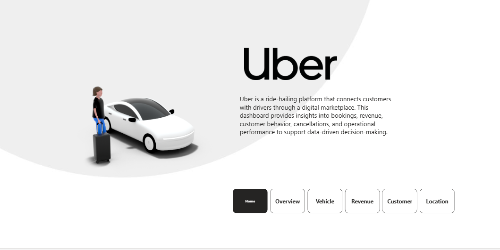
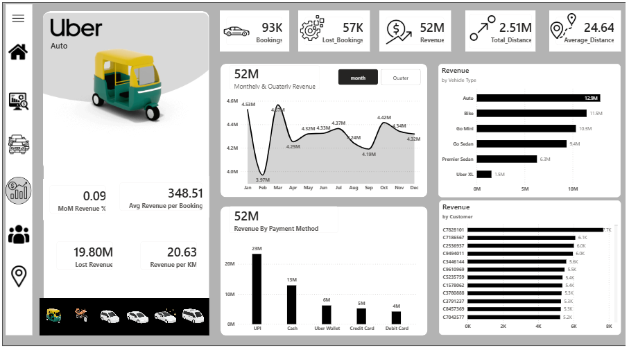

# 🚖 Uber Power BI Dashboard – Business Analytics Project

An end-to-end **Power BI analytics dashboard** designed to analyze Uber ride data and deliver actionable insights across **bookings, revenue, vehicles, customers, and locations**.  
This project focuses on **business-driven analytics**, data modeling, DAX calculations, and professional dashboard design.

---

## 🚀 Live Dashboard  
[Click here to view the Power BI report](https://app.fabric.microsoft.com/view?r=eyJrIjoiMWM3NDhiOWItNWZhNi00ODc2LTg1MjQtYmM2Y2Y5ODM1MTJkIiwidCI6ImY5YTQzODQwLWY3OGUtNDE3Yy05ZDgwLTg5NTJhMmJhN2Y0YiJ9)

---

## 📌 Project Overview

Uber operates at a large scale with thousands of daily rides. Managing such operations requires transforming raw ride data into **meaningful insights** that support decision-making.  
This project addresses key business questions related to **performance monitoring, revenue optimization, customer behavior, and operational efficiency** using Microsoft Power BI.

---

## 🎯 Business Objectives

- Monitor overall ride and revenue performance
- Identify revenue drivers and loss areas
- Analyze vehicle-wise contribution and efficiency
- Understand customer behavior and cancellation impact
- Identify peak demand locations and time slots
- Enable data-driven operational and strategic decisions

---

## 📂 Dataset Overview

The dataset represents **ride-level transactional data** and includes:

- Booking details (Booking ID, Status, Value)
- Vehicle types (Auto, Bike, Sedan, XL, etc.)
- Customer information
- Pickup and drop locations
- Distance traveled
- Time and date attributes
- Ratings and cancellation reasons

Data is analyzed on **monthly and quarterly** levels to identify trends and patterns.

---

## 🧱 Dashboard Architecture

The dashboard is structured into **five analytical pages**, each serving a specific business requirement:

1. Overview  
2. Vehicle  
3. Revenue  
4. Customer  
5. Location  

Interactive navigation buttons and filters allow seamless movement between pages.

---

## 📊 Page-wise Business Explanation

---

### 1️⃣ Home / Landing Page

**Purpose**
- Introduces the Uber analytics dashboard
- Provides context and navigation for users

**Key Features**
- Uber branding and visual identity
- Brief description of dashboard purpose
- Navigation buttons to all analytical pages

**Business Value**
- Improves user experience
- Makes the dashboard portfolio and stakeholder-ready

---

---

### 2️⃣ Overview Page

**Business Requirement**
Provide a high-level snapshot of Uber’s operational and financial performance.

**KPIs Displayed**
- Total Bookings
- Lost Bookings
- Total Revenue
- Total Distance
- Average Distance per Ride

**Insights Provided**
- Monthly and quarterly booking trends
- Revenue trends over time
- Revenue by vehicle type
- Top pickup and drop locations
- Average customer and driver ratings

**Business Value**
- Enables quick executive-level decision-making
- Identifies overall growth, decline, or inefficiencies

---

---

### 3️⃣ Vehicle Page

**Business Requirement**
Analyze performance at the vehicle level to optimize fleet usage.

**Key Metrics**
- Booking count by vehicle
- Revenue by vehicle type
- Revenue contribution percentage
- Ride completion rate
- Ride incomplete rate

**Insights Provided**
- Identification of top revenue-generating vehicles
- Comparison of completion efficiency across vehicle types
- Sparkline trends for completed bookings

**Business Value**
- Supports fleet optimization
- Helps improve pricing and incentive strategies

---

---
### 4️⃣ Revenue Page

**Business Requirement**
Provide detailed financial insights and identify revenue risks.

**Key Analysis**
- Monthly and quarterly revenue trends
- Revenue by vehicle type
- Revenue by payment method (UPI, Cash, Wallet, Cards)
- Revenue by top customers

**Efficiency & Risk Metrics**
- Month-on-Month revenue change
- Average revenue per booking
- Revenue per kilometer
- Lost revenue estimation

**Business Value**
- Identifies profitable segments
- Detects revenue leakage
- Supports financial planning and strategy

---

---

### 5️⃣ Customer Page

**Business Requirement**
Understand customer behavior, loyalty, and cancellation impact.

**Customer Segmentation**
- First-time customers
- Returning customers
- Regular customers

**Key Metrics**
- Customer cancellation rate
- Customer cancellation count
- Customer revenue risk percentage
- Estimated revenue impact due to customer cancellations

**Insights Provided**
- Top customer cancellation reason (e.g., Wrong Address)
- Customer trend over time
- Payment method preference
- Detailed customer-level table

**Business Value**
- Improves customer retention strategies
- Reduces revenue loss due to cancellations
- Enhances customer experience

---

---

### 6️⃣ Location Page

**Business Requirement**
Analyze geographic and time-based demand patterns.

**Key Insights**
- Total distance by vehicle type
- Distance covered by location
- Top active areas
- Peak demand time slots
- Day-wise and time-slot heatmap analysis

**Business Value**
- Optimizes driver allocation
- Supports surge pricing decisions
- Improves city-level operations

---

---

## 🛠 Tools & Technologies Used

- **Microsoft Power BI**
- **Microsoft Fabric / Power BI Service**
- **DAX (Data Analysis Expressions)**
- Data Modeling & Relationships
- Time Intelligence
- KPI Design & Dashboard UX Principles

## 📈 Business Impact

This dashboard enables Uber stakeholders to:

- Track business performance in real time
- Identify revenue growth and loss areas
- Improve fleet and driver utilization
- Reduce ride cancellations
- Enhance customer satisfaction
- Make informed, data-driven decisions

---

## 📚 Key Learnings

- End-to-end Power BI dashboard development
- Translating business requirements into analytics
- Practical use of DAX for real-world problems
- Data storytelling and professional dashboard design
- UX considerations for enterprise dashboards

---

## 🚀 Future Enhancements

- Real-time data integration
- Predictive demand forecasting
- Customer churn prediction
- Driver performance analytics
- Advanced AI-based insights

---

## 👤 Author

**Pralhad Balaji Jadhav**  
Aspiring Data Analyst | Power BI | Data Analytics  

📌 GitHub Repository:  
https://github.com/parlhad/Uber_Power-BI_Project

---

## 📎 Note

This project is created for **learning, portfolio, and demonstration purposes** using a sample dataset OF 1,50,000 rows and more than 10 Features
